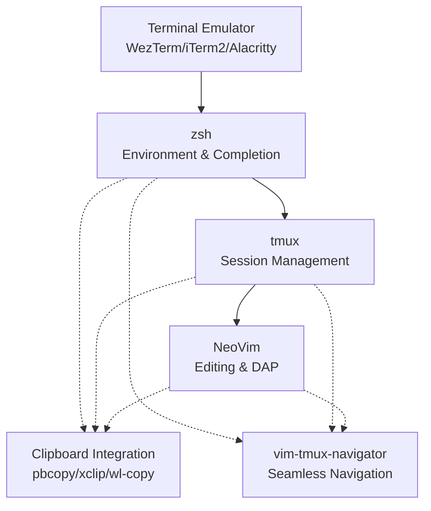

# 🔗 Comprehensive tmux + zsh + nvim Integration Guide

## Table of Contents

1. [Integration Architecture Overview](#integration-architecture-overview)
2. [Configuration Relationships](#configuration-relationships)
3. [Core Integration Workflows](#core-integration-workflows)
4. [Cross-Platform Compatibility](#cross-platform-compatibility)
5. [Troubleshooting Guide](#troubleshooting-guide)
6. [Performance Optimization](#performance-optimization)
7. [Security Considerations](#security-considerations)
8. [Manual Verification Steps](#manual-verification-steps)

---

## Integration Architecture Overview

### Component Stack



### Integration Flow

1. **Terminal Launch** → zsh sets environment (PATH, EDITOR, LANG)
2. **tmux Session** → inherits environment, loads plugins (TPM)
3. **NeoVim Launch** → integrates with tmux panes via navigator
4. **Shared Features** → clipboard, navigation, session persistence

---

## Configuration Relationships

### Environment Variables

| Variable | Source | Purpose | Consumers |
|----------|--------|---------|-----------|
| `PATH` | `zsh/.zshrc` | Tool discovery | tmux, nvim, plugins |
| `EDITOR` | `zsh/.zshrc` | Default editor | git, kubectl, scripts |
| `LANG` | `zsh/.zshrc` | Locale/encoding | tmux, nvim, completions |
| `TMUX` | tmux (auto) | Session detection | scripts, plugins |
| `COLORTERM` | terminal | Color support | starship, nvim themes |

### Key Configuration Files

```bash
# Core configurations
tmux/.tmux.conf                    # tmux + plugins (TPM)
zsh/.zshrc                         # main shell config
zsh/.zsh/                          # modular shell components
nvim/.config/nvim/lua/custom/      # neovim lua configs

# Integration points
zsh/.zsh/envs.zsh                  # environment variables
nvim/.../floating-term.lua         # in-editor terminals
nvim/.../dap-config.lua            # debugging integration
```

---

## Core Integration Workflows

### 1. Seamless Navigation (vim-tmux-navigator)

**Configuration:**
- tmux: `bind -n C-h run "(tmux display-message -p '#{pane_current_command}' | grep -iq vim && tmux send-keys C-h) || tmux select-pane -L"`
- nvim: `vim.keymap.set('n', '<C-h>', '<Cmd>TmuxNavigateLeft<CR>')`

**Workflow:**
```bash
# Navigate between tmux panes and nvim splits seamlessly
<C-h>  # Move left (works in both tmux and nvim)
<C-j>  # Move down
<C-k>  # Move up
<C-l>  # Move right
```

### 2. Clipboard Integration

**Platform Detection:**
```bash
# macOS
if command -v pbcopy &> /dev/null; then
    # Use pbcopy/pbpaste
# Linux X11
elif command -v xclip &> /dev/null; then
    # Use xclip
# Linux Wayland
elif command -v wl-copy &> /dev/null; then
    # Use wl-clipboard
fi
```

**tmux Integration:**
```bash
# tmux-yank plugin handles clipboard automatically
# Copy mode: 'y' copies to system clipboard
# Command: tmux save-buffer - | pbcopy  # manual copy
```

### 3. Session Management & Restoration

**tmux-resurrect + tmux-continuum:**
```bash
# Auto-save every 15 minutes
set -g @continuum-restore 'on'
set -g @continuum-save-interval '15'

# Manual operations
<prefix> + Ctrl-s   # Save session
<prefix> + Ctrl-r   # Restore session
```

**Exclude sensitive data:**
```bash
# In .tmux.conf
set -g @resurrect-capture-pane-contents 'on'
set -g @resurrect-save-bash-history 'on'
set -g @resurrect-save-shell-history 'on'
# Exclude SSH agent sockets and GPG info
set -g @resurrect-capture-pane-contents 'off'  # if security sensitive
```

### 4. Development Workflow Integration

**Editor Wrapper (`$HOME/.local/bin/editor`):**
```bash
#!/usr/bin/env sh
# Smart editor that prefers nvim-remote when available

if [ -n "$TMUX" ] && command -v nvr >/dev/null 2>&1; then
    # Use neovim remote in tmux sessions
    nvr "$@"
elif command -v nvim >/dev/null 2>&1; then
    nvim "$@"
else
    vi "$@"
fi
```

**Floating Terminal Integration:**
```lua
-- In nvim: lua/custom/floating-term.lua
-- <leader>ft opens floating terminal
-- Integrates with tmux when appropriate
```

### 5. Debugging Integration (DAP)

**Multi-Pane Debugging:**
```bash
# tmux layout for debugging
tmux new-window -n debug
tmux split-window -v -p 30  # Bottom pane for output
tmux split-window -h -p 50  # Right pane for REPL
tmux select-pane -t 0       # Focus main editor pane
```

**NeoVim DAP Integration:**
```lua
-- F9: Toggle breakpoint
-- F12: Start debugging
-- Uses tmux panes for debug console when configured
```

---

## Cross-Platform Compatibility

### Platform-Specific Configurations

#### macOS
```bash
# Homebrew paths (Apple Silicon)
export PATH="/opt/homebrew/bin:/opt/homebrew/sbin:$PATH"

# Clipboard
alias pbcopy='pbcopy'
alias pbpaste='pbpaste'

# Terminal integration
if [[ "$TERM_PROGRAM" == "WezTerm" ]]; then
    # WezTerm-specific OSC sequences
fi
```

#### Linux
```bash
# Homebrew on Linux (if installed)
export PATH="/home/linuxbrew/.linuxbrew/bin:$PATH"

# Clipboard utilities
if command -v wl-copy &> /dev/null; then
    alias pbcopy='wl-copy'
    alias pbpaste='wl-paste'
elif command -v xclip &> /dev/null; then
    alias pbcopy='xclip -selection clipboard'
    alias pbpaste='xclip -selection clipboard -o'
fi
```

### Required Packages by Platform

| Tool | macOS (Homebrew) | Ubuntu/Debian | Arch Linux |
|------|------------------|---------------|------------|
| Clipboard | `pbcopy` (built-in) | `xclip` or `wl-clipboard` | `xclip` or `wl-clipboard` |
| Terminal | `wezterm` | `wezterm` | `wezterm` |
| Shell | `zsh` | `zsh` | `zsh` |
| Multiplexer | `tmux` | `tmux` | `tmux` |
| Editor | `neovim` | `neovim` | `neovim` |

### Installation Commands

```bash
# macOS
brew install tmux neovim zsh wezterm

# Ubuntu/Debian
sudo apt update
sudo apt install tmux neovim zsh xclip

# Arch Linux
sudo pacman -S tmux neovim zsh xclip
```

---

## Troubleshooting Guide

### Navigation Issues

#### Problem: vim-tmux-navigator not working
**Symptoms:**
- `<C-h>`, `<C-j>`, `<C-k>`, `<C-l>` don't switch between tmux panes and nvim splits
- Navigation only works in one direction

**Diagnosis:**
```bash
# In nvim, check if plugin is loaded
:TmuxNavigatorProcessList

# In tmux, check current command detection
tmux display-message -p '#{pane_current_command}'

# Verify tmux key bindings
tmux list-keys | grep -E "C-(h|j|k|l)"
```

**Solutions:**
```bash
# 1. Optimize tmux detection (faster than ps-based)
# In .tmux.conf, replace ps-based detection with:
bind -n C-h if -F '#{==:#{pane_current_command},nvim}' 'send-keys C-h' 'select-pane -L'

# 2. Ensure nvim plugin is properly configured
# In nvim config:
vim.g.tmux_navigator_no_mappings = 1  -- Prevent default mappings
-- Then add explicit mappings

# 3. Check for conflicting keybindings
# List all nvim keymaps:
:nmap <C-h>
:imap <C-h>
```

### Clipboard Issues

#### Problem: Copy/paste not working between tmux, nvim, and system
**Symptoms:**
- Copying in tmux doesn't reach system clipboard
- NeoVim yank doesn't work outside editor
- System clipboard content not available in tmux/nvim

**Diagnosis:**
```bash
# Test system clipboard tools
pbcopy --version 2>/dev/null || echo "pbcopy not found"
xclip -version 2>/dev/null || echo "xclip not found"
wl-copy --version 2>/dev/null || echo "wl-copy not found"

# Test tmux clipboard
echo "test" | tmux load-buffer -
tmux show-buffer

# Check nvim clipboard support
nvim --version | grep clipboard
```

**Solutions:**
```bash
# 1. Install clipboard utilities
# macOS: pbcopy is built-in
# Linux X11:
sudo apt install xclip
# or
sudo apt install xsel
# Linux Wayland:
sudo apt install wl-clipboard

# 2. Configure tmux-yank for your platform
# In .tmux.conf:
set -g @yank_selection_mouse 'clipboard'
set -g @yank_action 'copy-pipe-and-cancel'

# 3. Set nvim clipboard provider
# In nvim config:
vim.opt.clipboard = "unnamedplus"  -- Use system clipboard
```

### Theme/Color Issues

#### Problem: Colors inconsistent between terminal, tmux, and nvim
**Symptoms:**
- Different colors in tmux status bar vs nvim
- Terminal colors don't match theme expectations
- Syntax highlighting breaks in tmux

**Diagnosis:**
```bash
# Check color support
echo $TERM
echo $COLORTERM
tput colors

# Test truecolor support
awk 'BEGIN{for (i=0;i<256;i++) printf "\033[48;5;%dm %3d\033[0m", i, i; print "" }'

# Check tmux color settings
tmux show-options -g | grep terminal
```

**Solutions:**
```bash
# 1. Enable truecolor support
export COLORTERM=truecolor

# 2. Configure tmux for proper color handling
# In .tmux.conf:
set -g default-terminal "tmux-256color"
set -ga terminal-overrides ",*256col*:Tc"

# 3. Ensure terminal emulator supports truecolor
# WezTerm: enabled by default
# iTerm2: enable in preferences
# Alacritty: add to config

# 4. Synchronize themes
# Use consistent color schemes across all tools
# Example: use same base16/nord theme for terminal, tmux, nvim
```

### Session Restoration Issues

#### Problem: tmux-resurrect restores stale or sensitive data
**Symptoms:**
- SSH sockets don't work after restore
- GPG agent connections fail
- Sensitive environment variables exposed

**Diagnosis:**
```bash
# Check what gets saved
cat ~/.local/share/tmux/resurrect/last

# Check current socket status
echo $SSH_AUTH_SOCK
gpgconf --list-dirs agent-socket
```

**Solutions:**
```bash
# 1. Configure exclusions in .tmux.conf
set -g @resurrect-save-shell-history 'off'
set -g @resurrect-capture-pane-contents 'off'

# 2. Add post-restore hooks
# Create ~/.local/bin/tmux-post-restore:
#!/bin/bash
# Restart GPG agent
gpgconf --kill gpg-agent
gpgconf --launch gpg-agent

# Restart SSH agent (if using custom)
pkill ssh-agent
eval $(ssh-agent)

# 3. Exclude sensitive commands from history
export HISTIGNORE="*ssh*:*gpg*:*password*"
```

### Performance Issues

#### Problem: Slow navigation or terminal response
**Symptoms:**
- Delay when switching between panes
- Slow shell startup affecting navigation
- High CPU usage in tmux/nvim

**Diagnosis:**
```bash
# Time shell startup
time zsh -i -c exit

# Check tmux performance
tmux display-message -p '#{pane_current_command}'  # Should be fast

# Profile nvim startup
nvim --startuptime startup.log
```

**Solutions:**
```bash
# 1. Optimize shell startup
# Move heavy initialization to interactive-only sections
# Use lazy loading for completions

# 2. Use faster detection methods
# Replace ps-based checks with #{pane_current_command}

# 3. Optimize nvim configuration
# Use lazy loading for plugins
# Enable performance guards for large files

# 4. Reduce tmux history
set -g history-limit 10000  # Default is often too high
```

---

## Performance Optimization

### Shell Startup Optimization

```bash
# Profile startup time
time zsh -i -c exit

# Use lazy loading for heavy tools
lazy_load_nvm() {
    unset -f nvm node npm
    export NVM_DIR="$HOME/.nvm"
    [ -s "$NVM_DIR/nvm.sh" ] && \. "$NVM_DIR/nvm.sh"
}
alias nvm='lazy_load_nvm; nvm'
alias node='lazy_load_nvm; node'
alias npm='lazy_load_nvm; npm'
```

### tmux Performance Tuning

```bash
# In .tmux.conf
set -g escape-time 0                # Faster escape sequences
set -g display-time 2000            # Messages display time
set -g status-interval 60           # Status bar update interval
set -g history-limit 10000          # Reasonable scrollback

# Use efficient navigator detection
bind -n C-h if -F '#{==:#{pane_current_command},nvim}' 'send-keys C-h' 'select-pane -L'
```

### NeoVim Optimization

```lua
-- Enable performance guards for large files
require('custom.perf-guards')

-- Lazy load heavy plugins
vim.defer_fn(function()
    require('custom.dap-config')
end, 100)

-- Optimize for terminal usage
vim.opt.lazyredraw = true      -- Don't redraw during macros
vim.opt.updatetime = 300       -- Faster completion
vim.opt.timeoutlen = 300       -- Faster key sequences
```

---

## Security Considerations

### Session Data Protection

```bash
# Exclude sensitive data from tmux-resurrect
set -g @resurrect-save-bash-history 'off'
set -g @resurrect-capture-pane-contents 'off'

# Use secure permissions for session files
chmod 600 ~/.local/share/tmux/resurrect/*
```

### Environment Variable Safety

```bash
# Don't persist sensitive environment variables
export HISTIGNORE="*API_KEY*:*PASSWORD*:*SECRET*:*TOKEN*"

# Clear sensitive vars before tmux save
unset AWS_SECRET_ACCESS_KEY  # Example
```

### GPG/SSH Agent Security

```bash
# Restart agents after session restore
# In ~/.local/bin/tmux-post-restore:
#!/bin/bash
if [ -n "$TMUX" ]; then
    # Clear potentially stale sockets
    unset SSH_AUTH_SOCK
    unset GPG_AGENT_INFO
    
    # Restart services
    gpgconf --kill gpg-agent
    eval $(ssh-agent)
fi
```

---

## Manual Verification Steps

### 1. Pre-Integration Checklist

```bash
# Verify all components are installed
command -v tmux || echo "Install tmux"
command -v nvim || echo "Install neovim"
command -v zsh || echo "Install zsh"

# Check shell is set to zsh
echo $SHELL
```

### 2. Navigation Testing

```bash
# Start tmux with multiple panes
tmux new-session -d -s test
tmux split-window -h
tmux split-window -v

# Launch nvim in one pane
tmux send-keys -t 0 'nvim' Enter

# Test navigation between panes and nvim splits
# Should work seamlessly with C-h/j/k/l
```

### 3. Clipboard Verification

```bash
# Test system clipboard
echo "test1" | pbcopy     # or xclip/wl-copy
pbpaste                   # should show "test1"

# Test tmux clipboard
tmux new-session -d
echo "test2" | tmux load-buffer -
tmux show-buffer          # should show "test2"

# Test nvim clipboard
nvim -c ':let @+ = "test3"' -c ':echo @+' -c ':q'
```

### 4. Session Restore Testing

```bash
# Create test session
tmux new-session -d -s restore-test
tmux send-keys 'echo "test session"' Enter

# Save session
tmux kill-session -t restore-test

# Restore session
tmux new-session -d -s restore-test
# Session should restore with command history
```

### 5. Cross-Platform Verification

#### macOS
```bash
# Test Homebrew paths
which tmux  # should be /opt/homebrew/bin/tmux
which nvim  # should be /opt/homebrew/bin/nvim

# Test pbcopy integration
echo "mac test" | pbcopy
pbpaste
```

#### Linux
```bash
# Test package manager installations
which tmux  # should be /usr/bin/tmux
which nvim  # should be /usr/bin/nvim

# Test clipboard utilities
echo "linux test" | xclip -selection clipboard
xclip -selection clipboard -o
```

### 6. Performance Verification

```bash
# Time shell startup (should be < 1 second)
time zsh -i -c exit

# Test navigation responsiveness
# C-h/j/k/l should respond immediately

# Check memory usage
ps aux | grep -E "(tmux|nvim|zsh)" | awk '{print $4, $11}'
```

### 7. Theme Consistency Check

```bash
# Verify color support
echo $COLORTERM  # should be "truecolor"
tput colors      # should be 256 or higher

# Check theme consistency
# Terminal, tmux status bar, and nvim should use consistent colors
```

---

## Integration Best Practices

### 1. Environment Management
- Keep essential exports in minimal `.zshenv` for non-interactive shells
- Use platform detection for PATH additions
- Set `EDITOR` to wrapper script that prefers `nvr` when available

### 2. Keybinding Coordination
- Audit all keybindings to prevent conflicts
- Use leader keys for application-specific commands
- Document keybinding hierarchy (tmux prefix → leader → local)

### 3. Session Management
- Combine tmux-resurrect with nvim session management
- Exclude sensitive data from automatic saves
- Use project-specific session templates

### 4. Performance Monitoring
- Profile startup times regularly
- Use lazy loading for heavy components
- Monitor memory usage in long-running sessions

### 5. Security Practices
- Never persist secrets in session saves
- Use secure permissions for configuration files
- Regularly audit saved session data

---

## Conclusion

This integration guide provides a comprehensive foundation for tmux + zsh + nvim workflow optimization. The configurations are designed to work seamlessly across macOS and Linux while maintaining security and performance best practices.

**Next Steps:**
1. Implement environment wrapper script
2. Add cross-platform clipboard detection
3. Audit and resolve keybinding conflicts
4. Test session restoration workflows
5. Monitor and optimize performance

For additional troubleshooting or platform-specific issues, refer to the individual tool documentation in the `docs/` directory.